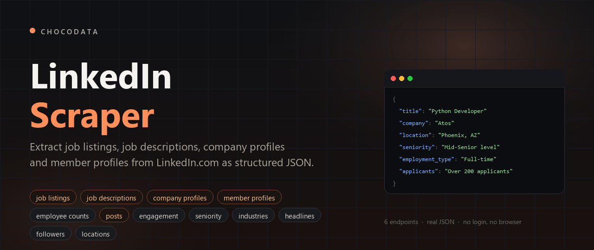
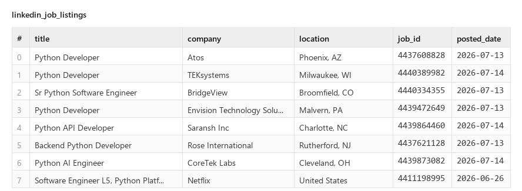
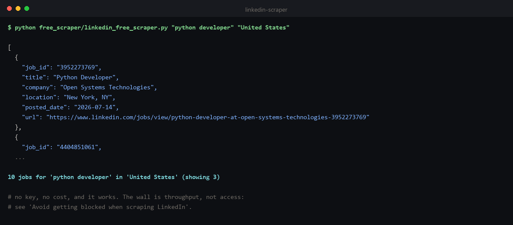
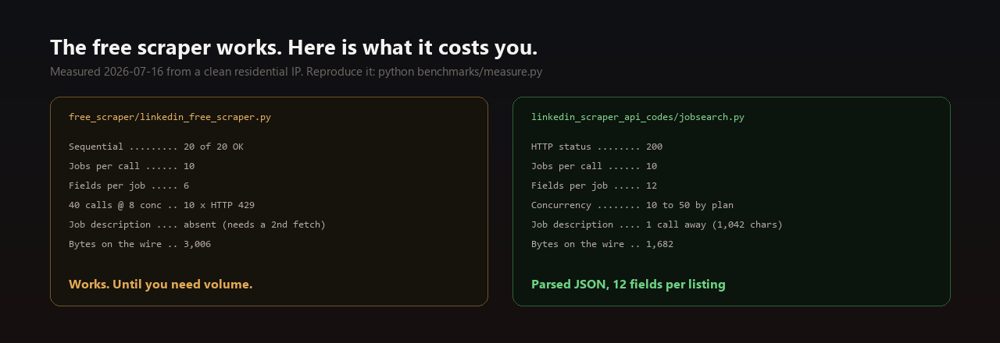
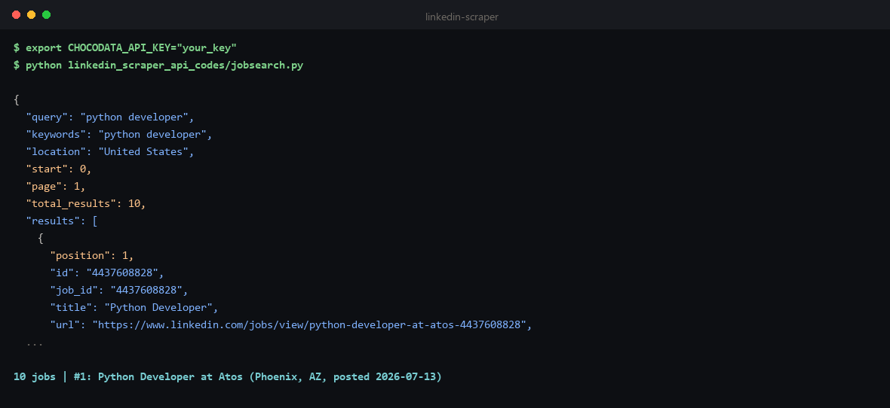
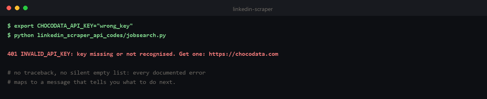
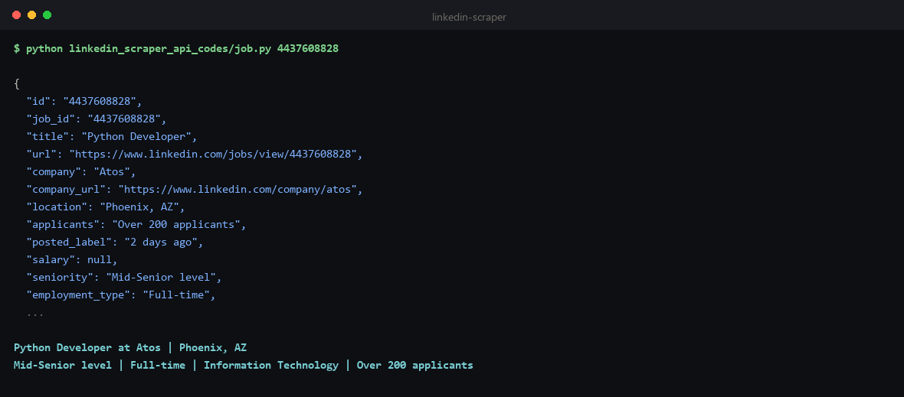
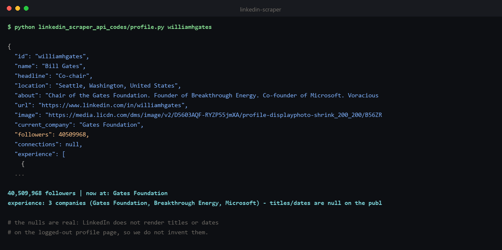
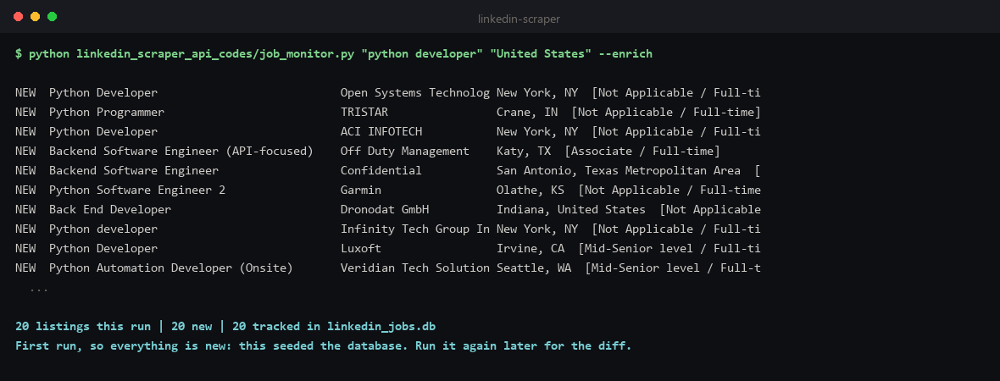

# LinkedIn Scraper



**LinkedIn Scraper for extracting job listings, job descriptions, company profiles, member profiles and posts from LinkedIn.com.** This repo has a free LinkedIn web scraping script you can run right now, and a LinkedIn data API with 6 endpoints returning real structured JSON.

**Last updated: 2026-07-16.** Working against LinkedIn.com as of July 2026, and re-verified whenever LinkedIn changes their markup.

Every JSON block on this page was captured from the live API on 2026-07-16. Long arrays are trimmed to the first item and long text is truncated where marked (each block says exactly what was cut); **every field shown is verbatim**, nothing is rewritten, padded, or invented. Full uncut samples are committed in [`linkedin_scraper_api_data/`](linkedin_scraper_api_data), including the [error bodies](linkedin_scraper_api_data/errors.json), so you can diff this page against them. Every code example calls the actual API and is runnable from [`linkedin_scraper_api_codes/`](linkedin_scraper_api_codes). Every measured number comes from [`benchmarks/measure.py`](benchmarks/measure.py), which is in the repo so you can re-run it rather than trust it.

```bash
pip install requests
export CHOCODATA_API_KEY="your_key"     # free: 1,000 requests, one-time, no card
python linkedin_scraper_api_codes/jobsearch.py
```

Those three lines return this, live from LinkedIn.com (7 of the 12 fields on the first listing, verbatim; the [full object is below](#1-job-search-job-listings-companies-and-posted-dates)):

```json
{
  "job_id": "4437608828",
  "title": "Python Developer",
  "company": "Atos",
  "company_url": "https://www.linkedin.com/company/atos",
  "location": "Phoenix, AZ",
  "posted_date": "2026-07-13",
  "salary": null
}
```

...multiplied by 10 listings per call, with 12 fields each (first 8 rows and 6 of the columns shown):



That is the whole point of this repo. The rest of this page is the free script, the measured evidence behind it, and the full API reference.

---

## Contents

- [Free LinkedIn Scraper](#free-linkedin-scraper)
- [Avoid getting blocked when scraping LinkedIn](#avoid-getting-blocked-when-scraping-linkedin)
  - [Using the Chocodata LinkedIn Scraper API](#using-the-chocodata-linkedin-scraper-api)
- [LinkedIn Scraper API reference](#linkedin-scraper-api-reference)
  - [Quickstart](#quickstart) · [Authentication](#authentication) · [Global parameters](#global-parameters) · [Errors](#errors) · [Rate limits and concurrency](#rate-limits-and-concurrency)
  - [1. Job search](#1-job-search-job-listings-companies-and-posted-dates) · [2. Job](#2-job-full-posting-seniority-employment-type-and-description) · [3. Company](#3-company-company-profile-employee-count-and-industry) · [4. Profile](#4-profile-member-name-headline-and-current-company) · [5. Post](#5-post-post-content-engagement-counts-and-media) · [6. Contact info](#6-contact-info-public-company-website-and-contact-fields)
- [Monitor new LinkedIn job postings](#monitor-new-linkedin-job-postings)
- [Measured latency](#measured-latency)

---

## Free LinkedIn Scraper

LinkedIn serves its logged-out job search through a guest endpoint that returns plain HTML job cards, so you can extract job listings without a headless browser, a login, or JavaScript rendering. No key, no cost:

```bash
python free_scraper/linkedin_free_scraper.py "python developer" "United States"
```

Source: [`free_scraper/linkedin_free_scraper.py`](free_scraper/linkedin_free_scraper.py). It calls `/jobs-guest/jobs/api/seeMoreJobPostings/search`, parses the returned card markup, and emits `job_id, title, company, location, posted_date, url`.

After running the command, your terminal should look something like this:



**It works.** From a clean residential IP on 2026-07-16 it returned 10 job cards on 20 of 20 sequential attempts.

So why does the rest of this page exist? Because "it works" and "it scales" are different claims, and the gap between them is the whole product. The next section is the measured version of that gap.

## Avoid getting blocked when scraping LinkedIn

The wall is not where people expect it. LinkedIn did not serve us a bot check, a CAPTCHA, or a 403. It served real data, until we asked for real volume. Every row below is produced by [`benchmarks/measure.py`](benchmarks/measure.py), which is in this repo: run it and you get your own version of this table.

| What we measured (2026-07-16, one clean residential IP) | Value |
|---|---|
| 20 sequential calls | **20 of 20 returned 10 job cards** |
| 40 calls at 8 concurrent | **30 OK, 10 x HTTP 429**, in 5.7s |
| Recovery after a 429 | **~1s** of sequential polling. It is a throttle, not a ban. |
| Fields per free job card | **6** |
| Job description on the card | **absent** (needs a second fetch per job) |



10 429s out of 40, from one IP, in 5.7 seconds. That is the whole problem in miniature, and it is the most important thing to understand about scraping LinkedIn at scale:

| What bites you | Why | What it costs you |
|---|---|---|
| **Concurrency, not access** | The guest endpoint answered 20 of 20 sequential calls. Fan out to 8 workers and the 429s start immediately. It is a throughput ceiling, not a ban. | Your scraper works perfectly on your laptop and falls over the day you parallelise it. The failure arrives in production, not in dev. |
| **You get HTML, not data** | A public profile page is 601,151 characters of markup and inline JSON. The fields you actually wanted are 910 characters of it. | You write and maintain a parser per surface, forever, and re-do it every time LinkedIn reshapes the page. |
| **Job cards are not job postings** | The search card has 6 fields. No description, no seniority, no employment type, no applicant count. Those live on the posting page. | One extra fetch and parse per job, which is exactly where the request volume (and the 429s) come from. |
| **The public surface is a subset** | LinkedIn does not render job titles or date ranges on the logged-out profile page at all. | What any public scrape returns is company names and headlines, not a dated employment history. See [`/linkedin/profile`](#4-profile-member-name-headline-and-current-company). |
| **The markup moves** | The guest card classes and the JSON shapes change without notice. Your parser silently returns `[]`. | Ongoing maintenance, plus alerting smart enough to tell "no results" from "broken". |

Two things worth knowing before you go shopping for a free alternative.

The first is that the most popular free LinkedIn scraper on GitHub, [`joeyism/linkedin_scraper`](https://github.com/joeyism/linkedin_scraper) (4,327 stars, actively maintained), takes a different route: it drives a real browser and requires you to log in. Its docs are explicit that "LinkedIn requires authentication" and it offers `login_with_credentials()` for your email and password. That is not a knock on the code, which does more than the script in this repo can. It is a trade you should make deliberately: logged-in scraping sees the fields the public page withholds, and it puts *your* account on the line. Nothing in this repo logs in.

The second is that LinkedIn's own `robots.txt` disallows all of it, and it is worth reading rather than paraphrasing. The `User-agent: *` block, in its entirety, is two lines: `User-agent: *` followed by `Disallow: /`. Everything. The other 75 blocks name specific crawlers LinkedIn has chosen to allow, and 40 of those (Googlebot included) are still disallowed from `/jobs-guest/` specifically, which is the exact path the free script above calls. The file also states that "the use of robots or other automated means to access LinkedIn without the express permission of LinkedIn is strictly prohibited", pointing to [their user agreement](https://www.linkedin.com/legal/user-agreement) and publishing a whitelisting address to request permission ([robots.txt](https://www.linkedin.com/robots.txt), retrieved 2026-07-16).

So: the free script is disallowed, and so is the API below. It is your call to make, and worth making with the actual text in front of you rather than discovering it later.

---

### Using the Chocodata LinkedIn Scraper API

The managed option, and the one this repo is built around. The [Chocodata LinkedIn Scraper API](https://chocodata.com/scraper-api/linkedin?utm_source=github&utm_medium=repo&utm_campaign=linkedin-scraper) has six endpoints for LinkedIn data extraction at scale (job listings, job postings, company profiles, member profiles, posts and public contact fields), parsed JSON instead of the raw page markup, a ~99% success rate, and no proxy management. Free for the first 1,000 requests.

---

## LinkedIn Scraper API reference

Below is the LinkedIn Scraper API reference to get you started: authentication, the global parameter, error handling, concurrency, and the six endpoints.

### Quickstart

```bash
curl "https://api.chocodata.com/api/v1/linkedin/jobsearch?api_key=YOUR_KEY&keywords=python%20developer&location=United%20States"
```

```python
import requests

r = requests.get(
    "https://api.chocodata.com/api/v1/linkedin/jobsearch",
    params={"api_key": "YOUR_KEY", "keywords": "python developer", "location": "United States"},
    timeout=90,
)
top = r.json()["results"][0]
print(top["title"], "at", top["company"], "|", top["location"])
# Python Developer at Atos | Phoenix, AZ
```

After running the command, your terminal should look something like this:



Get a key at chocodata.com (1,000 requests, one-time, no card).

### Authentication

Pass `api_key` as a query parameter on every request. That is the whole auth model. No OAuth, no LinkedIn login, no session cookie: you never hand us or LinkedIn an account.

### Global parameters

| Param | Type | Required | Default | Description |
|---|---|---|---|---|
| `api_key` | string | **yes** | - | Your Chocodata API key. The only parameter every endpoint shares. |

Everything else is per-endpoint and documented in its own table below. Note for anyone porting from our other scrapers: `country` is accepted but we could not measure any effect on LinkedIn responses, so it is not documented here as a feature. Geography on job search is controlled by the `location` parameter instead, and `add_html` works on [`/post`](#5-post-post-content-engagement-counts-and-media) only.

Each request costs **5 credits (= 1 request)**. Responses are billed only on success (2xx).

### Errors

Real captured error bodies, not paraphrases. Nothing below is billed: **you are only charged on a 2xx**.

| Status | `error` code | Meaning | Billed | What to do |
|---|---|---|---|---|
| `400` | `invalid_params` | A required param is missing or the wrong type. Body lists the exact issue and `path`. | no | Fix the query string. |
| `401` | `INVALID_API_KEY` | Key missing, unrecognised, or revoked. | no | Check `api_key`. Get one at chocodata.com. |
| `402` | `INSUFFICIENT_CREDITS` | Balance exhausted. | no | Top up or upgrade at chocodata.com. |
| `404` | `item_not_found` | The target returned 404: the id/URL does not exist or the posting was taken down. `retryable: false`. | no | Fix the id. Retrying will not help. |
| `429` | `RATE_LIMITED` | Over your plan's concurrency. | no | Back off and retry; see [Rate limits](#rate-limits-and-concurrency). |
| `502` | `target_unreachable` | LinkedIn refused every attempt for this request. `retryable: true`. | no | Retry. We hit this a few times while writing this page; it clears. |

Two response shapes exist: auth/billing errors nest under `error.code` (uppercase), while scrape-layer errors are flat with a lowercase `error` string plus `retryable`. Both are shown below.

The scripts in this repo map every documented status onto an actionable message, so a typo'd key does not hand you a stack trace:



A bad key, verbatim:

```bash
curl "https://api.chocodata.com/api/v1/linkedin/jobsearch?api_key=totally_invalid_key_123&keywords=python%20developer"
```
```json
{"error":{"code":"INVALID_API_KEY","message":"Api key not recognised."}}
```

A missing required param, verbatim. It names the exact field:

```json
{"error":"invalid_params","issues":[{"code":"invalid_type","expected":"string","received":"undefined","path":["keywords"],"message":"Required"}]}
```

A dead job id, verbatim. Note it tells you whether to retry, and that you were not charged:

```json
{
  "error": "item_not_found",
  "message": "The target returned 404 for this request - the item or identifier does not exist. Check the id or URL. You were not charged.",
  "attempts": 1,
  "attempted_tiers": ["paid-residential"],
  "retryable": false
}
```

### Rate limits and concurrency

There is no per-minute request cap. The limit is **concurrency**: how many requests you may have in flight at once. This is the ceiling the free script hits at 8 workers and never gets past.

| Plan | Concurrent requests |
|---|---|
| Free | 10 |
| Vibe | 30 |
| Pro | 50 |
| Custom | 100 to 500+ |

Exceed it and you get `429`, not a queue. Every endpoint is a **synchronous GET**: there is no webhook, callback, or async job to poll. A request can take up to ~10s when LinkedIn forces a re-attempt (see [Measured latency](#measured-latency)), which is why the examples use `timeout=90`.

Sizing: at Pro (50 concurrent) and the measured 1.6s median job search, one worker pool sustains roughly 50 / 1.6 = **31 requests/second**, so 100,000 requests is about 54 minutes of saturated pulling. Fan out with a thread pool:

```python
from concurrent.futures import ThreadPoolExecutor
import requests

def one(kw):
    r = requests.get("https://api.chocodata.com/api/v1/linkedin/jobsearch",
                     params={"api_key": KEY, "keywords": kw, "location": "United States"},
                     timeout=90)
    return kw, (r.json().get("results", []) if r.ok else [])

queries = ["python developer", "rust engineer", "data scientist", "sre", "ml engineer"]
with ThreadPoolExecutor(max_workers=10) as pool:   # <= your plan's concurrency
    for kw, results in pool.map(one, queries):
        print(kw, len(results))
```

---

### 1. Job search: job listings, companies and posted dates

Ranked LinkedIn job listings for a keyword and location, with company, company URL, location and posted date.

| Param | Type | Required | Default | Description |
|---|---|---|---|---|
| `keywords` | string | **yes** | - | Search keywords (e.g. `python developer`). |
| `location` | string | no | - | Geography to search, as LinkedIn spells it (e.g. `United States`, `Germany`). |
| `start` | int | no | `0` | Offset for paging. `start=10` is page 2. |
| `limit` | int | no | `10` | Listings to return. Caps at 10; page with `start` for more. |

```bash
curl "https://api.chocodata.com/api/v1/linkedin/jobsearch?api_key=YOUR_KEY&keywords=python%20developer&location=United%20States"
```

**Real response.** `results` cut to 1 of 10; `jobs` is a duplicate of `results` and is cut the same way; the job object is complete, all 12 fields verbatim ([full sample](linkedin_scraper_api_data/jobsearch.json)):

```json
{
  "query": "python developer",
  "keywords": "python developer",
  "location": "United States",
  "start": 0,
  "page": 1,
  "total_results": 10,
  "results": [
    {
      "position": 1,
      "id": "4437608828",
      "job_id": "4437608828",
      "title": "Python Developer",
      "url": "https://www.linkedin.com/jobs/view/python-developer-at-atos-4437608828",
      "company": "Atos",
      "company_url": "https://www.linkedin.com/company/atos",
      "location": "Phoenix, AZ",
      "posted_date": "2026-07-13",
      "posted_label": "2 days ago",
      "salary": null,
      "company_logo": "https://media.licdn.com/dms/image/v2/D4D0BAQEYl-E6odacMA/company-logo_100_100/company-logo_100_100/0/1688547764067/atos_logo?e=2147483647&v=beta&t=6OaDBPDrDtTvZlbSVQ19X1GSArzmZlg2DLGU7oFpr_Y"
    }
  ],
  "jobs": [
    {
      "position": 1,
      "id": "4437608828",
      "job_id": "4437608828",
      "title": "Python Developer",
      "url": "https://www.linkedin.com/jobs/view/python-developer-at-atos-4437608828",
      "company": "Atos",
      "company_url": "https://www.linkedin.com/company/atos",
      "location": "Phoenix, AZ",
      "posted_date": "2026-07-13",
      "posted_label": "2 days ago",
      "salary": null,
      "company_logo": "https://media.licdn.com/dms/image/v2/D4D0BAQEYl-E6odacMA/company-logo_100_100/company-logo_100_100/0/1688547764067/atos_logo?e=2147483647&v=beta&t=6OaDBPDrDtTvZlbSVQ19X1GSArzmZlg2DLGU7oFpr_Y"
    }
  ]
}
```

`job_id` is the field most people come for: it is the key you feed to [`/linkedin/job`](#2-job-full-posting-seniority-employment-type-and-description) for the description and seniority, and it is the join key for tracking one posting over time. `posted_date` is a real ISO date (LinkedIn only shows you "2 days ago" on the page), which is what makes a diff-based monitor possible.

Four things to know before you build on this, none of which are in a competitor's docs:

- **`total_results` is not a corpus total.** It equals the number of rows returned, so `limit=3` gives `total_results: 3`. It tells you nothing about how many jobs LinkedIn has for the query. Do not size a crawl with it.
- **`jobs` is a byte-identical duplicate of `results`, and `id` duplicates `job_id`.** Every payload carries both of each. Pick one of each pair; do not count both.
- **`salary` was null on 10 of 10 listings** in this capture, and it is null on most LinkedIn cards, because LinkedIn only renders a salary when the poster supplied one. It is a real field, not a reliable one.
- **`limit` caps at 10.** We asked for 25 and 50 and got 10 both times. Page with `start` instead (`start=10`, `start=20`, ...), which we verified returns fresh non-overlapping listings to at least `start=50`. Repeat calls for the same query can also return a different slice: LinkedIn rotates its guest results, so a monitor sees new rows on a re-run even when nothing was posted.

`/linkedin/search` is an alias of this endpoint: same parameters, same response object, and it additionally accepts `q` as a synonym for `keywords`. It returns job listings, not people or content. It is documented here rather than as a seventh endpoint because that is all it is.

Runnable: [`linkedin_scraper_api_codes/jobsearch.py`](linkedin_scraper_api_codes/jobsearch.py)

---

### 2. Job: full posting, seniority, employment type and description

The full job posting by `job_id`: description text and HTML, seniority, employment type, job function, industries and applicant count.

| Param | Type | Required | Default | Description |
|---|---|---|---|---|
| `job_id` | string (digits) | one of `job_id`/`url` | - | LinkedIn job id (e.g. `4437608828`), as returned by job search. |
| `url` | string (URL) | one of `job_id`/`url` | - | Full LinkedIn job URL. |

```bash
curl "https://api.chocodata.com/api/v1/linkedin/job?api_key=YOUR_KEY&job_id=4437608828"
```

**Real response.** `description` truncated at 210 of 1,042 chars and `description_html` at 150 of 1,131, both marked with `...`; every one of the 17 fields is present and verbatim ([full sample](linkedin_scraper_api_data/job.json)):

```json
{
  "id": "4437608828",
  "job_id": "4437608828",
  "title": "Python Developer",
  "url": "https://www.linkedin.com/jobs/view/4437608828",
  "company": "Atos",
  "company_url": "https://www.linkedin.com/company/atos",
  "location": "Phoenix, AZ",
  "applicants": "Over 200 applicants",
  "posted_label": "2 days ago",
  "salary": null,
  "seniority": "Mid-Senior level",
  "employment_type": "Full-time",
  "job_function": "Information Technology",
  "industries": "IT Services and IT Consulting",
  "description": "About the Role: We are looking a skilled Python Developer with strong Google Cloud Platform (GCP) experience to design, develop, and support cloud-native applications and data solutions. The ideal candidate wil...",
  "description_html": "<p>About the Role:</p><p>We are looking a skilled Python Developer with strong Google Cloud Platform (GCP) experience to design, develop, and support ...",
  "company_logo": "https://media.licdn.com/dms/image/v2/D4D0BAQEYl-E6odacMA/company-logo_100_100/company-logo_100_100/0/1688547764067/atos_logo?e=2147483647&v=beta&t=6OaDBPDrDtTvZlbSVQ19X1GSArzmZlg2DLGU7oFpr_Y"
}
```

This is the endpoint that makes the whole thing worth automating: `description` (1,042 chars here) is the only place the actual requirements live, and `seniority` plus `employment_type` are the two fields people filter on. You get both text and `description_html`, so you can keep the formatting or throw it away.

Running it:



One call returns one posting, so enriching a search costs one request per job on top of the search itself. Size any monitoring job on that. A posting taken down between your search and your fetch returns `404 item_not_found` rather than stale data, so your enrichment loop has to tolerate it (the one in this repo does).

Runnable: [`linkedin_scraper_api_codes/job.py`](linkedin_scraper_api_codes/job.py)

---

### 3. Company: company profile, employee count and industry

The public company profile by vanity slug: employee count, follower count, industry, headquarters, website, specialties and description.

| Param | Type | Required | Default | Description |
|---|---|---|---|---|
| `company` | string | **yes** | - | Company vanity slug from `linkedin.com/company/<slug>` (e.g. `microsoft`). |

```bash
curl "https://api.chocodata.com/api/v1/linkedin/company?api_key=YOUR_KEY&company=microsoft"
```

**Real response.** `description` truncated at 170 of 745 chars and `specialties` at 120 of 370; all 13 fields verbatim, including `founded: null` ([full sample](linkedin_scraper_api_data/company.json)):

```json
{
  "id": "microsoft",
  "name": "Microsoft",
  "url": "https://www.linkedin.com/company/microsoft",
  "followers": 28637847,
  "employee_count": 233210,
  "industry": "Software Development",
  "company_size": "10,001+ employees",
  "headquarters": "Redmond, Washington",
  "website": "https://news.microsoft.com/",
  "description": "Every company has a mission. What's ours? To empower every person and every organization to achieve more. We believe technology can and should be a force for good and tha...",
  "founded": null,
  "specialties": "Business Software, Developer Tools, Home & Educational Software, Tablets, Search, Advertising, Servers, Windows Operatin...",
  "logo": "https://media.licdn.com/dms/image/v2/D560BAQH32RJQCl3dDQ/company-logo_200_200/B56ZYQ0mrGGoAM-/0/1744038948046/microsoft_logo?e=2147483647&v=beta&t=ts9MGrTk7Lz3R1bmAfzCL8euuuuPWPCoXfdiLA2_IzM"
}
```

`employee_count` (233,210) is the number people come for: it is LinkedIn's own count of members who list this company, and tracking it over time is a headcount signal you cannot buy cleanly anywhere else. Note it is not the same thing as `company_size` ("10,001+ employees"), which is the self-reported band the company picked.

`founded` is `null` here. That is not a parse failure: Microsoft does not render a founded year on its public page, so we return null rather than invent one. It is populated when LinkedIn shows it (Stripe returns `2010`, NVIDIA `1993`). The same applies to `headquarters` and `specialties` on companies that leave them blank. Code against the nulls.

Runnable: [`linkedin_scraper_api_codes/company.py`](linkedin_scraper_api_codes/company.py)

---

### 4. Profile: member name, headline and current company

The public member profile by username: name, headline, location, about, current company, follower count, and the company and school names.

| Param | Type | Required | Default | Description |
|---|---|---|---|---|
| `username` | string | one of `username`/`url` | - | Vanity name from `linkedin.com/in/<username>` (e.g. `williamhgates`). |
| `url` | string (URL) | one of `username`/`url` | - | Full LinkedIn profile URL. |

```bash
curl "https://api.chocodata.com/api/v1/linkedin/profile?api_key=YOUR_KEY&username=williamhgates"
```

**Real response.** `image` URL truncated; nothing else touched. All 12 fields, 3 experience and 1 education entries verbatim, nulls included ([full sample](linkedin_scraper_api_data/profile.json)):

```json
{
  "id": "williamhgates",
  "name": "Bill Gates",
  "headline": "Co-chair",
  "location": "Seattle, Washington, United States",
  "about": "Chair of the Gates Foundation. Founder of Breakthrough Energy. Co-founder of Microsoft. Voracious reader. Avid traveler. Active blogger.",
  "url": "https://www.linkedin.com/in/williamhgates",
  "image": "https://media.licdn.com/dms/image/v2/D5603AQF-RYZP55jmXA/profile-displa...",
  "current_company": "Gates Foundation",
  "followers": 40509945,
  "connections": null,
  "experience": [
    {
      "title": null,
      "company": "Gates Foundation",
      "date_range": null,
      "location": null
    },
    {
      "title": null,
      "company": "Breakthrough Energy",
      "date_range": null,
      "location": null
    },
    {
      "title": null,
      "company": "Microsoft",
      "date_range": null,
      "location": null
    }
  ],
  "education": [
    {
      "school": "Harvard University",
      "degree": null,
      "date_range": null
    }
  ]
}
```



`current_company` plus `followers` is the pair worth having: a member resolved to a live employer with an audience size attached, which is what makes this usable as an enrichment step.

`experience[].title`, `experience[].date_range`, `experience[].location` and `education[].degree` come back **null on every profile we tested** (we checked williamhgates, satyanadella, jeffweiner08, reidhoffman and melindagates: 0 titles and 0 dates populated across 23 experience entries). `connections` is null on some profiles and `500+` on others. LinkedIn does not render job titles or date ranges on the logged-out profile page, and this API never logs in, so what the endpoint returns is the company names, the school names, the headline, the about text and the follower count. Code against the nulls.

Runnable: [`linkedin_scraper_api_codes/profile.py`](linkedin_scraper_api_codes/profile.py)

---

### 5. Post: post content, engagement counts and media

A public LinkedIn post by URL: text content, like and comment counts, media, hashtags, mentions and author.

| Param | Type | Required | Default | Description |
|---|---|---|---|---|
| `url` | string (URL) | **yes** | - | Full post URL (`linkedin.com/posts/...-activity-<id>-<code>`). |
| `add_html` | boolean | no | `false` | Also return the raw upstream HTML alongside the parsed JSON (debugging). Adds ~189 KB. |

```bash
curl "https://api.chocodata.com/api/v1/linkedin/post?api_key=YOUR_KEY&url=https://www.linkedin.com/posts/satyanadella_looking-ahead-to-2026-activity-7411490079984250880-Vb5v"
```

**Real response.** `media[].mediaUrl` truncated; all 12 fields verbatim, empty arrays and nulls included ([full sample](linkedin_scraper_api_data/post.json)):

```json
{
  "content": "A few reflections on the year ahead for our industry ... https://lnkd.in/gwygrzzB",
  "content_markdown": null,
  "engagement": {
    "likes": 4068,
    "comments": 364,
    "shares": null,
    "views": null
  },
  "hashtags": [],
  "media": [
    {
      "mediaType": "image",
      "mediaUrl": "https://media.licdn.com/dms/image/sync/v2/D5627AQElyumqPbAGzw/articles...",
      "mediaDescription": "image"
    }
  ],
  "mentions": [],
  "comments": [],
  "postAuthor": {
    "authorId": null,
    "authorName": "Satya Nadella",
    "authorProfileLink": "https://www.linkedin.com/in/satyanadella",
    "authorUsername": "satyanadella"
  },
  "postId": "7411490079984250880",
  "postLink": "https://www.linkedin.com/posts/satyanadella_looking-ahead-to-2026-activity-7411490079984250880-Vb5v",
  "postedAt": "2025-12-29T19:35:33.873Z",
  "socialPlatform": "linkedin"
}
```

`engagement.likes` plus `postedAt` is the pair worth having: an exact ISO timestamp against a like count lets you measure decay, which the page itself never shows you. Note this endpoint returns **camelCase** keys (`postAuthor`, `postId`, `postedAt`) while the rest of the API is snake_case. Code against that.

`shares` and `views` are null and `comments` is an empty array even though this post has 364 of them: LinkedIn does not render comment bodies or share and view counts on the logged-out page, so the engagement you get is the like and comment counts, without the comment text. `content_markdown` is null on every post we captured.

Runnable: [`linkedin_scraper_api_codes/post.py`](linkedin_scraper_api_codes/post.py)

---

### 6. Contact info: public company website and contact fields

Public contact fields for a company or member page, on `/linkedin/email`.

| Param | Type | Required | Default | Description |
|---|---|---|---|---|
| `url` | string (URL) | one of `url`/`username` | - | Full LinkedIn company or member URL. |
| `username` | string | one of `url`/`username` | - | Vanity name. Resolved as a member (`/in/<username>`). |

```bash
curl "https://api.chocodata.com/api/v1/linkedin/email?api_key=YOUR_KEY&url=https://www.linkedin.com/company/microsoft"
```

**Real response.** Nothing cut. All 6 fields exactly as returned ([full sample](linkedin_scraper_api_data/email.json)):

```json
{
  "url": "https://www.linkedin.com/company/microsoft/",
  "is_company": true,
  "email": null,
  "website": "https://news.microsoft.com/",
  "phone": null,
  "note": "LinkedIn member emails are private (behind the logged-in \"Contact info\" modal) and are essentially never present in the public/logged-out page; only an external website (and rarely a company phone) is publicly exposed."
}
```

`website` is the field this endpoint delivers: a company's external domain, populated on 6 of 6 companies we checked (Microsoft, Stripe, NVIDIA, OpenAI, Shopify, Airbnb). Treat it as "resolve a LinkedIn company page to its real domain", which is a genuinely useful step in an enrichment pipeline.

`email` and `phone` were null on every page we tested. Member emails sit behind the logged-in "Contact info" modal and are not in the public HTML, which is why the response ships a `note` field saying so in the payload itself rather than returning a bare null and letting you assume you queried it wrong.

Runnable: [`linkedin_scraper_api_codes/contact_info.py`](linkedin_scraper_api_codes/contact_info.py)

---

## Monitor new LinkedIn job postings

Watching for new postings is the main reason people scrape LinkedIn, so that use case is in the repo end to end rather than as a snippet. [`job_monitor.py`](linkedin_scraper_api_codes/job_monitor.py) polls a job search, stores every posting it has ever seen as a local dataset in SQLite, optionally enriches each new one with seniority and employment type, and prints only what is new since the last run:

```bash
python linkedin_scraper_api_codes/job_monitor.py "python developer" "United States" --enrich
```



That is a real first run: nothing to compare against, so it seeds the database and says so. Run it again and you get only the diff:

```bash
# 20 listings this run | 10 new | 30 tracked in linkedin_jobs.db
```

Export the dataset whenever you want, no lock-in:

```bash
sqlite3 -header -csv linkedin_jobs.db "SELECT * FROM postings;" > jobs.csv
```

Do this arithmetic before you start: the script pulls **2 pages per run, so 2 requests per run**, plus 1 per new job with `--enrich`. Hourly checks on a single query is 24 runs a day, so **48 requests a day, and the 1,000 free requests are gone in about 20 days** (enrichment eats it faster). Drop to every 4 hours and the same query runs for about 80 days on the free tier.

One thing visible in that second run: 10 of 20 listings were "new" on an immediate re-run, because LinkedIn rotates which slice of results the guest surface returns rather than because 10 jobs were posted in a minute. Dedupe on `job_id` (the script does) and treat the first day of any monitor as a warm-up, not a signal.

---

## Measured latency

Real end-to-end wall-clock, measured from a laptop against the live API on 2026-07-16 by [`benchmarks/measure.py`](benchmarks/measure.py). This includes the upstream fetch, the anti-bot handling, and the parse:

| Endpoint | Median | Range | n |
|---|---|---|---|
| `/linkedin/jobsearch` | 1.6s | 1.4 to 2.5s | 5 |
| `/linkedin/job` | 1.8s | 1.2 to 8.0s | 5 |
| `/linkedin/company` | 2.9s | 2.3 to 10.1s | **4** |
| `/linkedin/profile` | 2.2s | 1.8 to 3.4s | 5 |
| `/linkedin/post` | 1.9s | 1.7 to 4.2s | 5 |
| `/linkedin/email` | 3.9s | 1.8 to 5.6s | 5 |

Read the ranges, not just the medians. The 10.1s on `/linkedin/company` and the 8.0s on `/linkedin/job` are the interesting numbers: those are requests that ran into a refusal upstream and were re-attempted until real data came back. Absorbing that, silently, is a good part of what you are paying for.

Note `n=4` on `/linkedin/company`: the fifth call returned a `502 target_unreachable`, so it is excluded from the median rather than folded into it. Small sample; run `benchmarks/measure.py` and use your own numbers.

---

## License

MIT. See [LICENSE](LICENSE).
